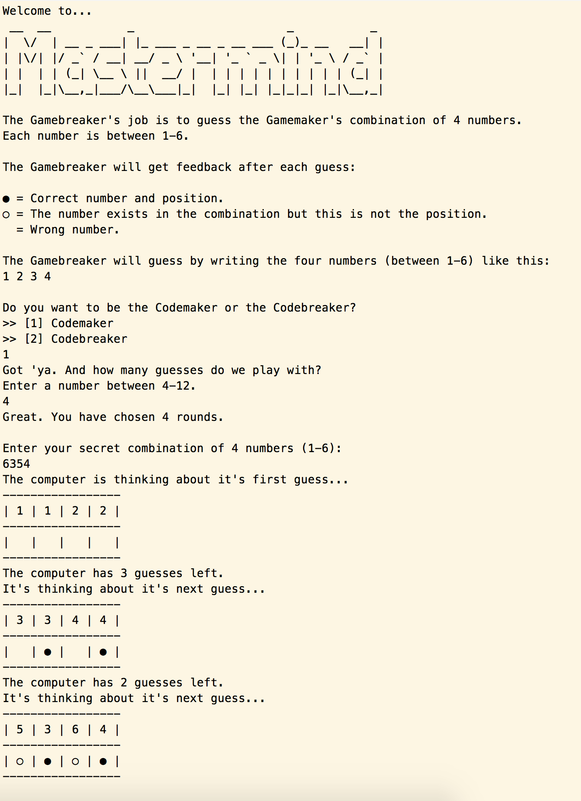

# Mastermind w/ AI

The crafting of the game has definitely been my biggest achievement to date. There are two play modes:
- **Gamemaker** => You set the code and the computer guess
- **Gamebreaker** => The computer sets the code and you guess

I've kept my eyes of other people's solutions. The only help I've had is the usage of [Knudth's five-guess algorithm](https://en.wikipedia.org/wiki/Mastermind_(board_game)), which was a huge help in developing the AI in Gamemaker mode. This approach led me on a lot of creative "could this work?" detours, which I learned a lot from.

### Try it out
Play my game [at Repl.it »](https://repl.it/MEd9/0)

### What it looks like

### Tricky part
It was difficult for me to figure out how to remove the invalid solutions from the list of solutions. The #delete-command really tricked me. My solution became the opposite approach. I created an array of solutions that were still in play and discarded the rest after each guess. Sounds basic but it really frustrated me.

The project is a part of the curriculum at [The Odin Project](www.theodinproject.com), which I'm currently eating my way through. 